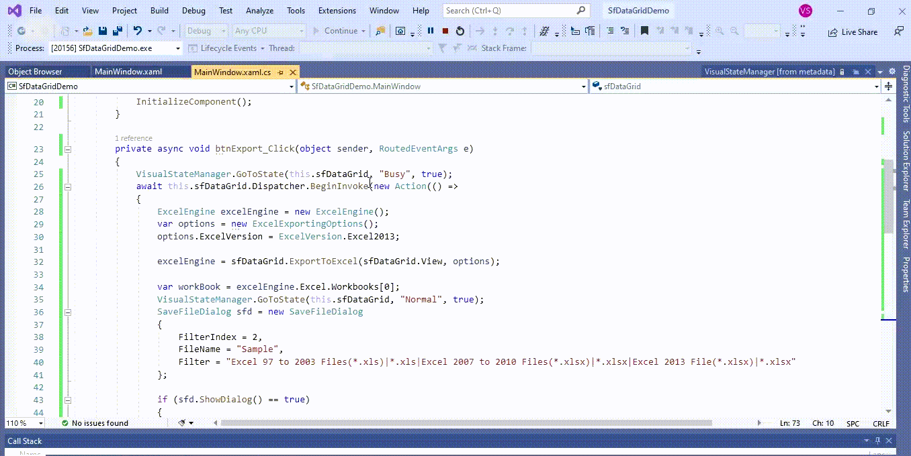

# How to Sshow the Progress Indicator When Export the WPF DataGrid into Excel?

This example illustrates how to show the progress indicator when export the [WPF DataGrid](https://www.syncfusion.com/wpf-controls/datagrid) (SfDataGrid) into Excel.

By default, `DataGrid` does not provide the support to show the progress indicator when export to excel. You can show the progress indicator when export to excel by using the busy Indicator in `DataGrid`.

#### C#
```C#
private async void btnExport_Click(object sender, RoutedEventArgs e)
{
    VisualStateManager.GoToState(this.sfDataGrid, "Busy", true);
    await this.sfDataGrid.Dispatcher.BeginInvoke(new Action(() =>
    {
        ExcelEngine excelEngine = new ExcelEngine();
        var options = new ExcelExportingOptions();
        options.ExcelVersion = ExcelVersion.Excel2013;

        excelEngine = sfDataGrid.ExportToExcel(sfDataGrid.View, options);

        var workBook = excelEngine.Excel.Workbooks[0];
        VisualStateManager.GoToState(this.sfDataGrid, "Normal", true);
        SaveFileDialog sfd = new SaveFileDialog
        {
            FilterIndex = 2,
            FileName = "Sample",
            Filter = "Excel 97 to 2003 Files(*.xls)|*.xls|Excel 2007 to 2010 Files(*.xlsx)|*.xlsx|Excel 2013 File(*.xlsx)|*.xlsx"
        };

        if (sfd.ShowDialog() == true)
        {
            using (Stream stream = sfd.OpenFile())
            {
                if (sfd.FilterIndex == 1)
                    workBook.Version = ExcelVersion.Excel97to2003;
                else if (sfd.FilterIndex == 2)
                    workBook.Version = ExcelVersion.Excel2010;
                else
                    workBook.Version = ExcelVersion.Excel2013;
                workBook.SaveAs(stream);
            }

            //Message box confirmation to view the created workbook.

            if (MessageBox.Show("Do you want to view the workbook?", "Workbook has been created",
                                MessageBoxButton.YesNo, MessageBoxImage.Information) == MessageBoxResult.Yes)
            {
                //Launching the Excel file using the default Application.[MS Excel Or Free ExcelViewer]
                System.Diagnostics.Process.Start(sfd.FileName);
            }
        }
    }), System.Windows.Threading.DispatcherPriority.Background);
}
```



## Requirements to run the demo
Visual Studio 2015 and above versions